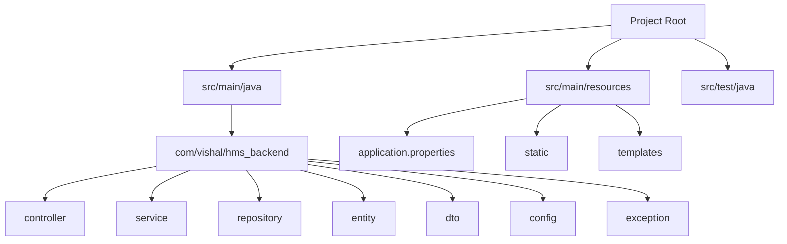
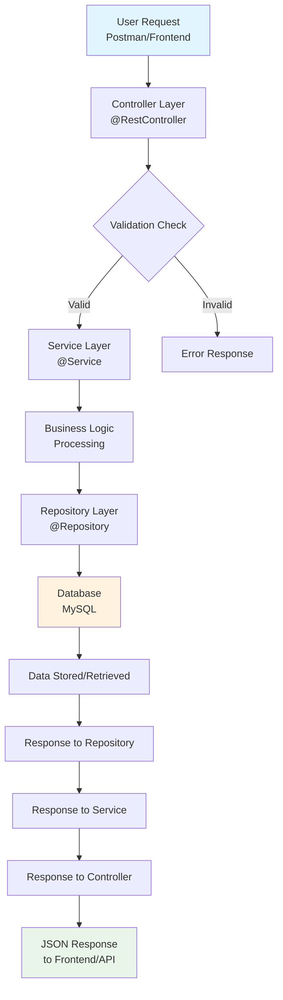
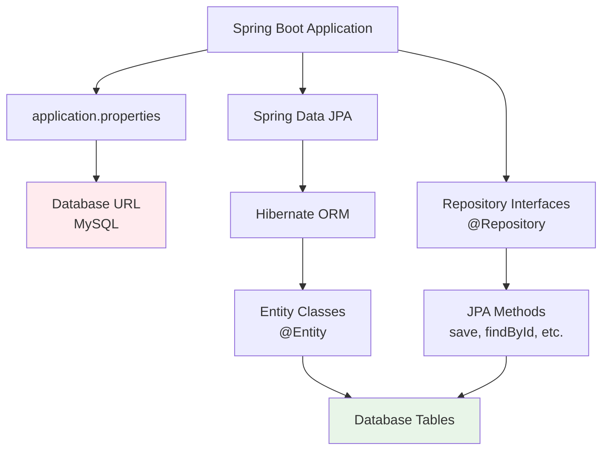
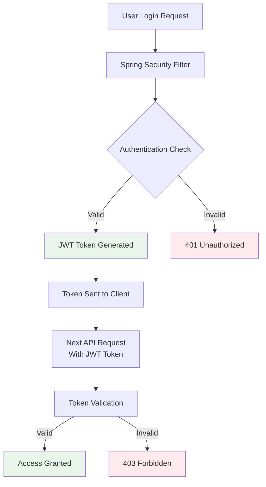
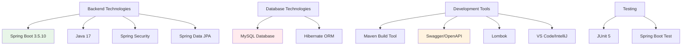

# HMS (Hospital Management System) - College Seminar Presentation

---

## 1️⃣ Project Overview

### What problem this project solves
Imagine a busy hospital where doctors, nurses, and staff are struggling with paperwork. Patient records are lost, appointments are missed, and billing is chaotic. Our HMS project solves this real-world problem by digitizing everything!

### Why this project is needed
- **Eliminates paperwork**: No more lost files or messy handwriting
- **Saves time**: Quick access to patient records and appointments
- **Reduces errors**: Digital records are more accurate than manual entries
- **Improves patient care**: Doctors can focus on patients instead of paperwork

### Who will use it
- **Doctors**: To view patient history and prescribe treatments
- **Nurses**: To manage patient care and schedules
- **Receptionists**: To handle appointments and billing
- **Hospital Administrators**: To generate reports and manage resources
- **Patients**: To book appointments and view their medical history

---

## 2️⃣ Current Project Status

### ✅ Features Completed
- **Backend Setup**: Spring Boot project structure is ready
- **Database Connection**: MySQL database is configured and connected
- **Security Framework**: Spring Security is integrated
- **API Documentation**: Swagger/OpenAPI is set up for API documentation

### 🔄 Features Partially Completed
- **Basic Project Structure**: Controller, Service, Repository folders are created but empty
- **Database Configuration**: Connection is established but tables need to be created

### ⏳ Features Pending
- **User Authentication**: Login and registration system
- **Patient Management**: CRUD operations for patient records
- **Appointment Booking**: Schedule and manage appointments
- **Doctor Management**: Doctor profiles and availability
- **Billing System**: Invoice and payment processing
- **Frontend Development**: React/Angular interface for users

---

## 3️⃣ Spring Boot Working (High Level)

### What is Spring Boot
Think of Spring Boot as a **ready-made kitchen** for building web applications. Instead of buying ingredients, utensils, and setting up everything yourself, Spring Boot gives you a fully equipped kitchen where you can start cooking immediately!

### Why Spring Boot is used
- **Fast Development**: Build applications quickly with minimal setup
- **Auto-configuration**: Spring Boot automatically configures things for you
- **Production Ready**: Built-in features for monitoring, logging, and security
- **Large Community**: Lots of help and resources available

### How Spring Boot Application Starts

```mermaid
flowchart TD
    A[Main Method Called] --> B[@SpringBootApplication Annotation]
    B --> C[Spring Application Starts]
    C --> D[Auto-Configuration Runs]
    D --> E[Database Connection Established]
    E --> F[Server Starts on Port 8080]
    F --> G[Application Ready for Requests]
```

### Role of Key Annotations

#### @SpringBootApplication
This is like the **master key** that unlocks everything:
- Tells Spring this is the main application class
- Enables auto-configuration (Spring Boot sets up things automatically)
- Scans for other components in the project

#### @RestController
This is like the **receptionist** of your application:
- Handles incoming web requests (HTTP requests)
- Returns responses in JSON format
- Maps URLs to specific methods

#### @Service
This is like the **manager** who does the actual work:
- Contains business logic
- Processes data between Controller and Repository
- Handles calculations and validations

#### @Repository
This is like the **librarian** who manages data:
- Handles database operations (CRUD)
- Communicates with the database
- Manages data persistence

---

## 4️⃣ Folder Structure Analysis



### Folder by Folder Explanation

#### 📁 **controller** (The Reception Desk)
- **Purpose**: Handles incoming requests from users
- **Analogy**: Like hospital receptionists who receive patients
- **Contains**: Classes with @RestController annotation
- **Example**: `PatientController`, `AppointmentController`

#### 📁 **service** (The Medical Staff)
- **Purpose**: Contains business logic and rules
- **Analogy**: Like doctors and nurses who make medical decisions
- **Contains**: Classes with @Service annotation
- **Example**: `PatientService`, `AppointmentService`

#### 📁 **repository** (The Medical Records Room)
- **Purpose**: Manages database operations
- **Analogy**: Like the records room where patient files are stored
- **Contains**: Interfaces extending JpaRepository
- **Example**: `PatientRepository`, `AppointmentRepository`

#### 📁 **entity** (The Patient File Template)
- **Purpose**: Defines database table structure
- **Analogy**: Like the template for creating patient files
- **Contains**: Classes with @Entity annotation
- **Example**: `Patient`, `Appointment`, `Doctor`

#### 📁 **dto** (The Summary Forms)
- **Purpose**: Data Transfer Objects for API communication
- **Analogy**: Like summary forms sent between departments
- **Contains**: Plain Java classes for data transfer
- **Example**: `PatientDTO`, `AppointmentDTO`

#### 📁 **config** (The Hospital Rules)
- **Purpose**: Configuration classes for the application
- **Analogy**: Like hospital policy documents
- **Contains**: Security, database, and other configurations
- **Example**: `SecurityConfig`, `DatabaseConfig`

#### 📁 **exception** (The Emergency Procedures)
- **Purpose**: Custom exception handling
- **Analogy**: Like emergency response procedures
- **Contains**: Custom exception classes
- **Example**: `PatientNotFoundException`, `AppointmentConflictException`

#### 📁 **resources** (The Supply Room)
- **Purpose**: Configuration files and static resources
- **Analogy**: Like the hospital supply room
- **Contains**: application.properties, static files, templates

#### 📄 **application.properties** (The Settings Panel)
- **Purpose**: Main configuration file
- **Analogy**: Like the hospital's main control panel
- **Contains**: Database settings, security keys, logging levels

---

## 5️⃣ File Connection Flow (End-to-End)



### Story Flow Explanation

1. **User Request**: A user (or Postman) sends a request like "Save patient details"

2. **Controller Reception**: The Controller receives the request like a receptionist receiving a patient

3. **Validation Check**: Controller checks if the data is valid (like checking if patient form is complete)

4. **Service Processing**: If valid, the Service layer processes the business logic (like doctor examining patient)

5. **Repository Operation**: Service asks Repository to save/fetch data (like nurse updating medical records)

6. **Database Action**: Repository performs the actual database operation (like filing the record)

7. **Response Journey**: Data flows back through the same layers to reach the user

---

## 6️⃣ Database Connectivity Explanation



### Database Components Explained

#### **MySQL Database**
- **Why MySQL?**: It's reliable, free, and widely used in healthcare systems
- **Analogy**: Like a digital filing cabinet that's very secure and organized

#### **Spring Boot Database Connection**
- **How it connects**: Through `application.properties` file
- **Key settings**: URL, username, password, and driver configuration
- **Analogy**: Like having the address and keys to the database building

#### **JPA (Java Persistence API)**
- **What it is**: A standard way to work with databases in Java
- **Analogy**: Like a universal translator between Java and database language
- **Benefits**: No need to write complex SQL queries manually

#### **Hibernate**
- **What it is**: The actual implementation of JPA
- **Analogy**: Like the worker who actually translates and executes the database operations
- **Features**: Auto-creates tables, manages relationships, handles caching

#### **Entity Classes**
- **Purpose**: Java classes that represent database tables
- **Analogy**: Like blueprints for database tables
- **Example**: `Patient` class becomes `patient` table in database

#### **Repository Interfaces**
- **Purpose**: Provide methods for database operations
- **Analogy**: Like a remote control for the database
- **Built-in methods**: `save()`, `findById()`, `findAll()`, `delete()`

---

## 7️⃣ How Data Flows

```mermaid
flowchart TD
    A[Frontend/Postman<br/>JSON Data] --> B[Controller<br/>@RestController]
    B --> C[DTO Object<br/>Data Transfer]
    C --> D[Service Layer<br/>Business Logic]
    D --> E[Entity Object<br/>Database Model]
    E --> F[Repository<br/>JPA Operations]
    F --> G[MySQL Database<br/>Table Storage]
    
    G --> H[Entity Retrieved]
    H --> I[Service Processing]
    I --> J[DTO Conversion]
    J --> K[Controller Response]
    K --> L[JSON Response<br/>to Frontend]
    
    style A fill:#e3f2fd
    style G fill:#ffebee
    style L fill:#e8f5e8
```

### Data Flow Story

#### **Data Coming IN (Save Operation)**
1. **Frontend sends JSON**: `{"name": "John", "age": 30}`
2. **Controller receives**: Converts JSON to DTO object
3. **Service processes**: Validates data, applies business rules
4. **Entity conversion**: DTO → Entity for database storage
5. **Repository saves**: Uses JPA to store in MySQL table
6. **Database stores**: Data is now permanently saved

#### **Data Going OUT (Fetch Operation)**
1. **Repository fetches**: Gets data from MySQL as Entity
2. **Service processes**: Applies business logic, filters data
3. **DTO conversion**: Entity → DTO (hides sensitive data)
4. **Controller responds**: Converts DTO to JSON
5. **Frontend receives**: JSON data for display

---

## 8️⃣ Security (Spring Security)



### Security in Simple Terms

#### **JWT (JSON Web Token)**
- **What it is**: A digital passport for users
- **Analogy**: Like a hospital ID card that proves who you are
- **Contains**: User information and expiration date
- **How it works**: Show the card, get access; no card, no entry

#### **Spring Security**
- **What it does**: Acts like a security guard for your application
- **Features**:
  - **Authentication**: "Who are you?" (Login process)
  - **Authorization**: "What can you do?" (Role-based access)
- **Analogy**: Like hospital security that checks IDs and permissions

#### **Security Flow**
1. **User logs in** with username/password
2. **Spring Security validates** credentials
3. **JWT token is created** and sent back
4. **User includes token** in future requests
5. **Each request is checked** before allowing access

---

## 9️⃣ Technologies Used



### Technology Stack Explained

#### **Backend Technologies**
- **Spring Boot 3.5.10**: Main framework for building the application
- **Java 17**: Programming language (latest stable version)
- **Spring Security**: For authentication and authorization
- **Spring Data JPA**: For database operations

#### **Database Technologies**
- **MySQL**: Relational database for storing patient data
- **Hibernate**: ORM framework for database communication

#### **Development Tools**
- **Maven**: Dependency management and build tool
- **Swagger**: API documentation and testing interface
- **Lombok**: Reduces boilerplate code in Java
- **VS Code/IntelliJ**: IDE for development

#### **Testing Framework**
- **JUnit 5**: For unit testing
- **Spring Boot Test**: For integration testing

---

## 🔟 Conclusion for Seminar

### What I Learned from This Project

#### **Technical Skills**
- **Spring Boot Framework**: Learned how to build enterprise applications
- **Database Design**: Understanding of relational databases and JPA
- **Security Implementation**: How to secure web applications
- **API Development**: Creating RESTful APIs for frontend consumption

#### **Professional Skills**
- **Problem Solving**: How to break down complex problems
- **Project Planning**: Understanding software development lifecycle
- **Code Organization**: Importance of clean architecture
- **Team Collaboration**: Working with different technologies together

### Real-World Usage

#### **Healthcare Industry**
- **Patient Management**: Hospitals can manage patient records efficiently
- **Appointment Systems**: Reduce waiting times and improve scheduling
- **Billing Automation**: Streamline payment processes
- **Data Analytics**: Generate insights for better healthcare

#### **Beyond Healthcare**
- **Educational Institutions**: Student management systems
- **Banking**: Customer management and transaction systems
- **Retail**: Inventory and customer relationship management
- **Government**: Public service management systems

### Future Scope

#### **Short-term Goals**
- **Complete Basic Features**: Patient, doctor, appointment management
- **Frontend Development**: React/Angular interface
- **Mobile App**: React Native for mobile access
- **Testing**: Comprehensive unit and integration tests

#### **Long-term Vision**
- **AI Integration**: Symptom checker and treatment recommendations
- **Telemedicine**: Video consultation features
- **IoT Integration**: Connect with medical devices
- **Cloud Deployment**: AWS/Azure for scalability
- **Blockchain**: Secure medical record sharing

#### **Advanced Features**
- **Machine Learning**: Predictive analytics for diseases
- **Real-time Notifications**: SMS and email alerts
- **Multi-language Support**: Serve diverse populations
- **Advanced Analytics**: Business intelligence dashboard

---

## 🎯 Final Message

This Hospital Management System project is not just a college assignment - it's a stepping stone toward understanding how real-world software applications are built. 

The skills learned here - Spring Boot, database management, security, and API development - are exactly what companies are looking for in today's job market.

Remember: **Every expert was once a beginner.** This project teaches us that complex systems are built one step at a time, with patience and continuous learning.

**Thank you for your attention! Are there any questions?**

---

*Prepared by: [Your Name]*
*College: [Your College Name]*
*Project: Hospital Management System (HMS)*
*Date: [Current Date]*
