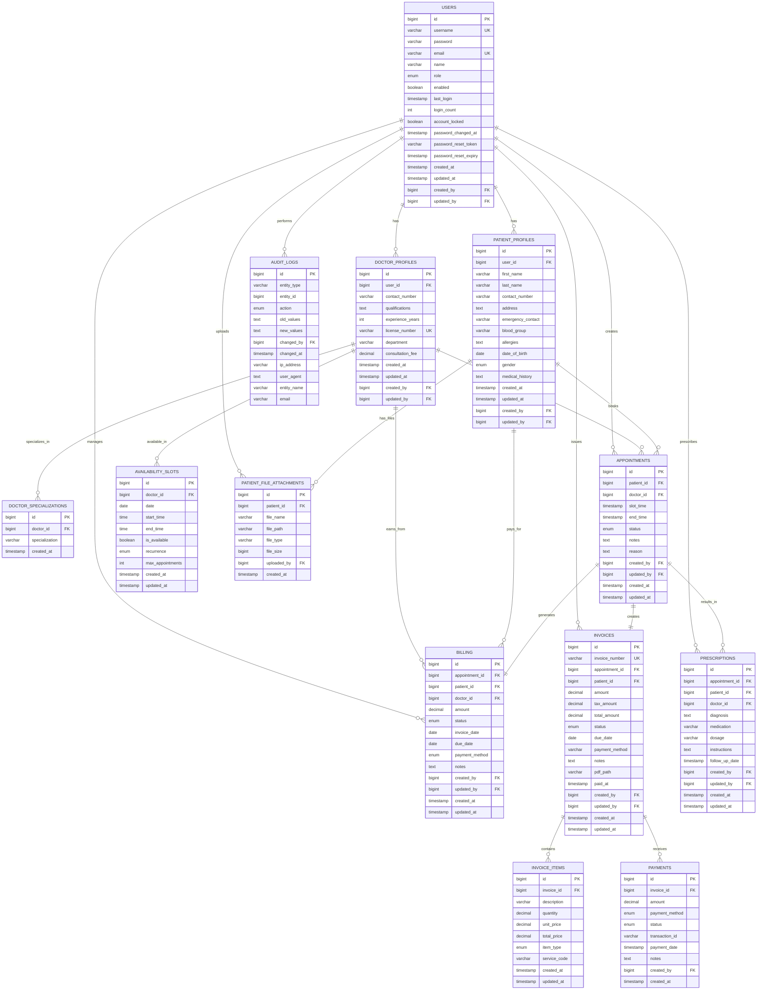

# Hospital Management System - ER Diagram

## Entity-Relationship Diagram Overview

## ER Diagram Description

### Core Entities

1. **USERS** - Central authentication entity
2. **PATIENT_PROFILES** - Extended patient information
3. **DOCTOR_PROFILES** - Extended doctor information
4. **APPOINTMENTS** - Appointment scheduling
5. **BILLING** - Financial billing records
6. **INVOICES** - Detailed invoice management
7. **PRESCRIPTIONS** - Medical prescriptions
8. **AUDIT_LOGS** - System audit trail

### Relationships Summary

| Relationship | Cardinality | Description |
|--------------|-------------|-------------|
| User → Patient Profile | 1:1 | One user has one patient profile |
| User → Doctor Profile | 1:1 | One user has one doctor profile |
| Patient → Appointments | 1:N | One patient has many appointments |
| Doctor → Appointments | 1:N | One doctor has many appointments |
| Appointment → Billing | 1:1 | One appointment has one billing record |
| Invoice → Invoice Items | 1:N | One invoice has many line items |
| User → Audit Logs | 1:N | One user generates many audit logs |

### Key Constraints

- **Unique Constraints:** username, email, license_number, invoice_number
- **Foreign Key Constraints:** All relationships maintain referential integrity
- **Check Constraints:** Email format, phone numbers, positive amounts
- **Business Rules:** Appointment end_time > start_time, due_date >= invoice_date
